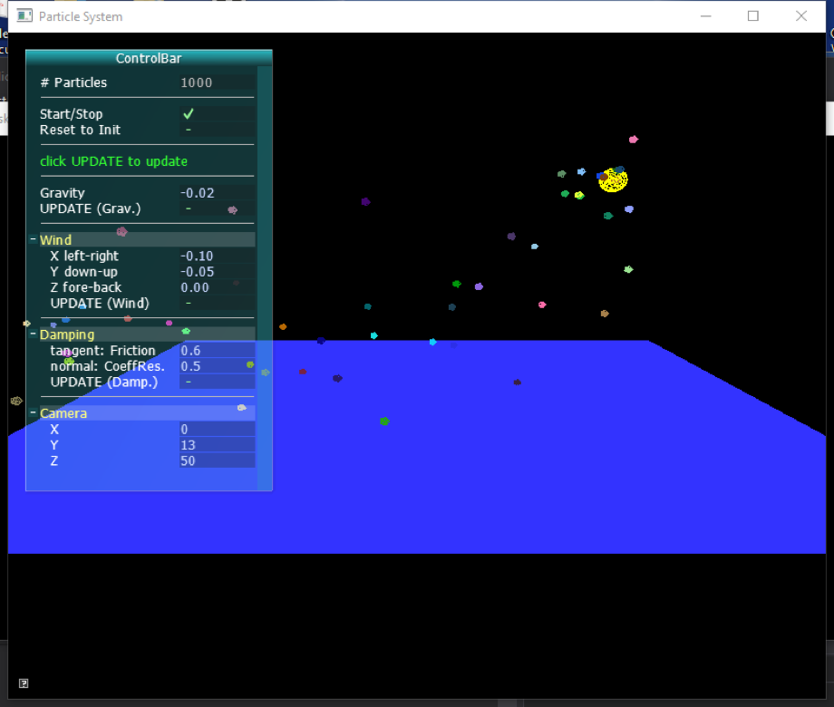

# 2017 Fall Computer Animation and Gaming CS6323
Instructor: **Dr. GUO Xiaohu**

This course focuses on both theoretical foundations and programming techniques involved in computer animation and game engines.  
Subjects include 2D and 3D transformations, skeletons, forward and inverse kinematics, particle systems, rigid bodies, collision detection, etc.

## What's inside the folder
This folder contains the source code for the project of the course.

- `Project1` is the whole visual studio project folder including the source code and some useful library files.

- `Project-Proposal.pdf` is the requirement for the project.

- `animproject.pptx` is the slide used during the 10-minute demo of the project.

- `Report.docx` is the report for the project including description of the work, detailed implementations and analysis.

- `project.png` is the snapshot of the user interface.

## Project: Particle System
C++ / OpenGL2 / Desktop Application

The project is to implement a particle system, animate about 1000 particles with simple physics (gravity and wind), and bounce off the particles against a ground plane with damping.

Detailed description is in `Report.docx`

## How to run the code
You can run it easily using Visual Studio:
1. download the Visual Studio project folder `Project1` and open it using Visual Studio
2. make sure the required libraries and dependency files are all in the `Project1/Project1` folder
3. in Visual Studio, you may need to go to "Tools" --> "NuGet Package Manager" --> "Manager Console"  
    input `Install-Package nupengl.core` to install the dependencies for `glut.h` and `GL.h`
4. compile and run

You may run it under other C++ IDE or environment, with OpenGL2 installed (`glut.h` and `GL.h` needed).  
The source code is `main.cpp` in the `Project1/Project1` folder. Some useful libraries and dependencies are in the same folder as well:
(you may not need all of them according to your OS):
   - `AntTweakBar.h`
   - `AntTweakBar.dll`
   - `AntTweakBar.lib`
   - `libAntTweakBar.so`
   - `libAntTweakBar.so.1`
